# 🚀 Projet Nginx & MySQL avec Vagrant
## Description
Ce projet utilise Vagrant pour configurer un environnement de développement avec :
- Un serveur web Nginx
- Un serveur MySQL
- Une mini application front
## Prérequis
- [Vagrant](https://www.vagrantup.com/downloads)
- [VirtualBox](https://www.virtualbox.org/wiki/Downloads)

### 1. Initialisation et configuration de Vagrant
```sh
vagrant init
```
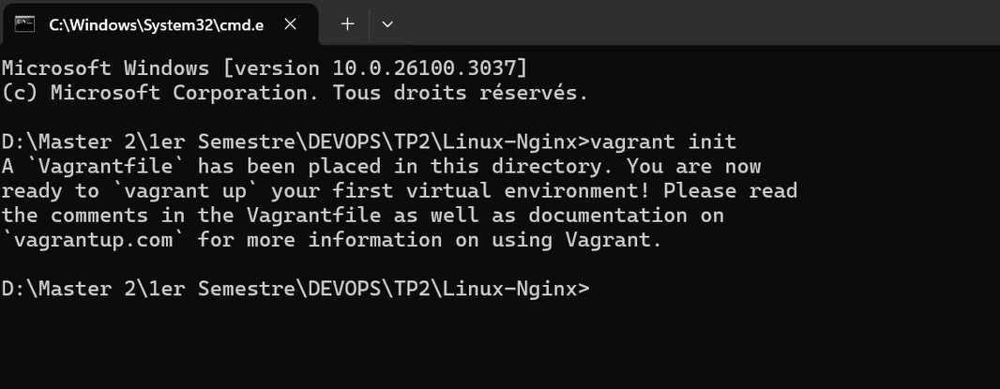
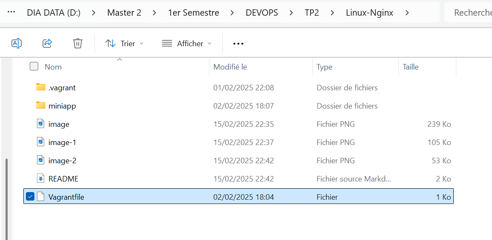
### 📝 Cela génère un fichier Vagrantfile de configuration.

## ⚙ Configuration du Vagrantfile
#### Modifiez le fichier Vagrantfile pour définir la machine virtuelle souhaitée sur VSCode ou votre éditeur préféré. <br>
#### Choisissez une box : Visitez Vagrant Cloud et sélectionnez bento/ubuntu-22.04.
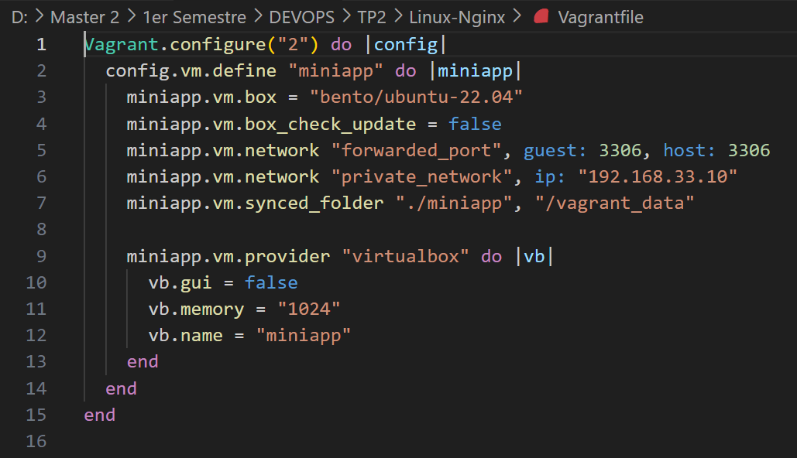

## ✅Validation et Démarrage de la VM
<h3> Après avoir configuré le Vagrantfile, vous pouvez valider la configuration avec cette commande pour vérifier si la configuration est correcte. </h3> 

### 1️⃣ Validez votre configuration
#### Cette commande permet de vérifier si la configuration est correcte :
```sh
vagrant validate
```


### 2️⃣ Démarrez la machine virtuelle
```sh
vagrant up
```
#### 💡 Cela lance la VM.
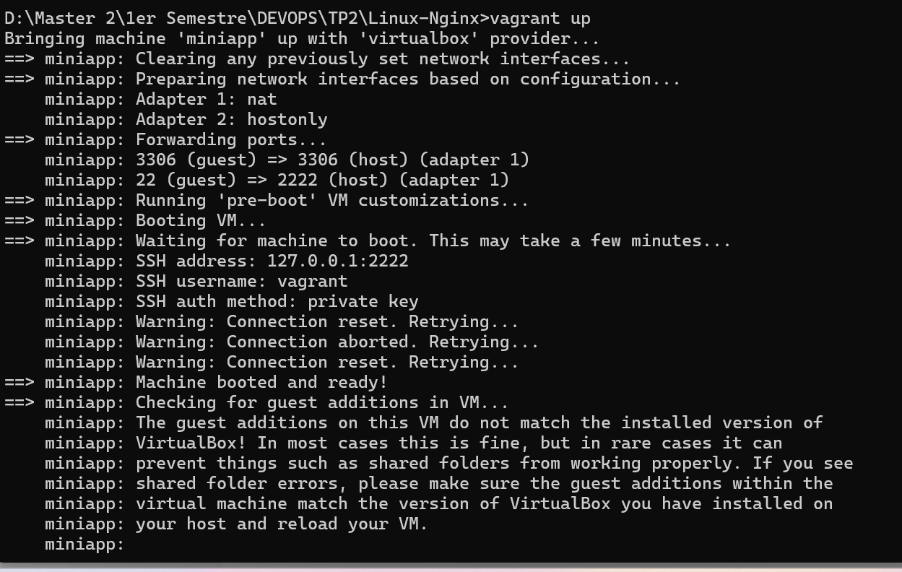
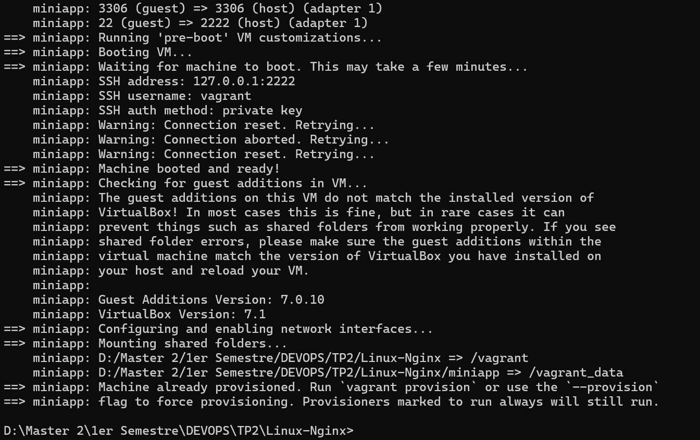
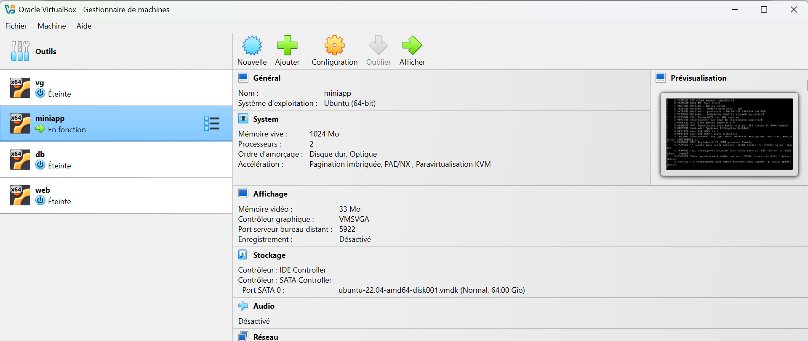

### 3️⃣ Accédez à la VM via SSH
```sh
vagrant ssh miniapp
```
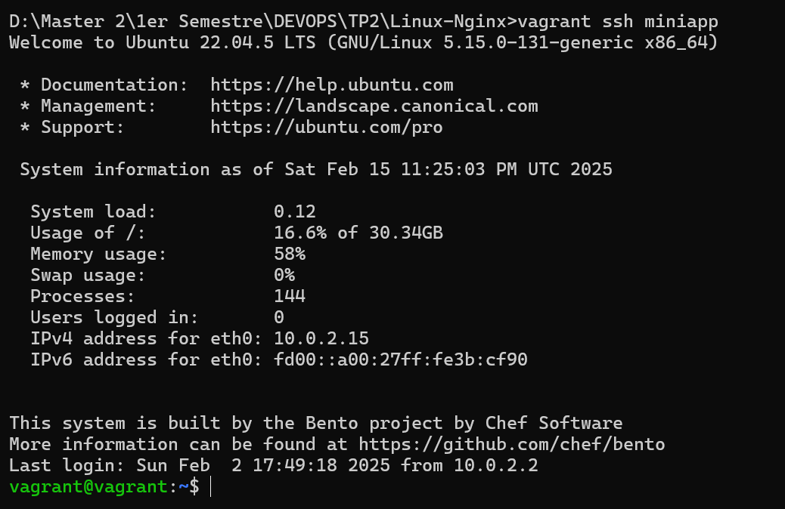


### 4. Installer les packages: 
#### Mets à jour les paquets de la VM :
```sh
sudo apt update && sudo apt upgrade -y
```
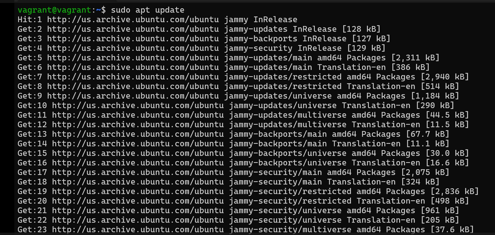
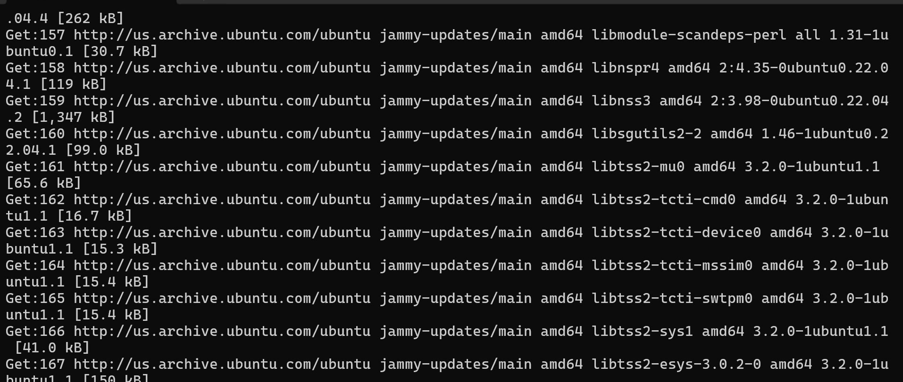
### 5. Installer NGINX
Maintenant installez Nginx sur Ubuntu:
```sh
-sudo apt install nginx -y
```
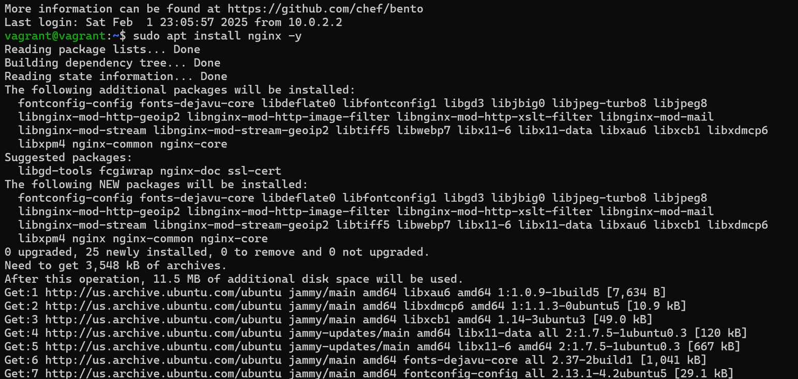
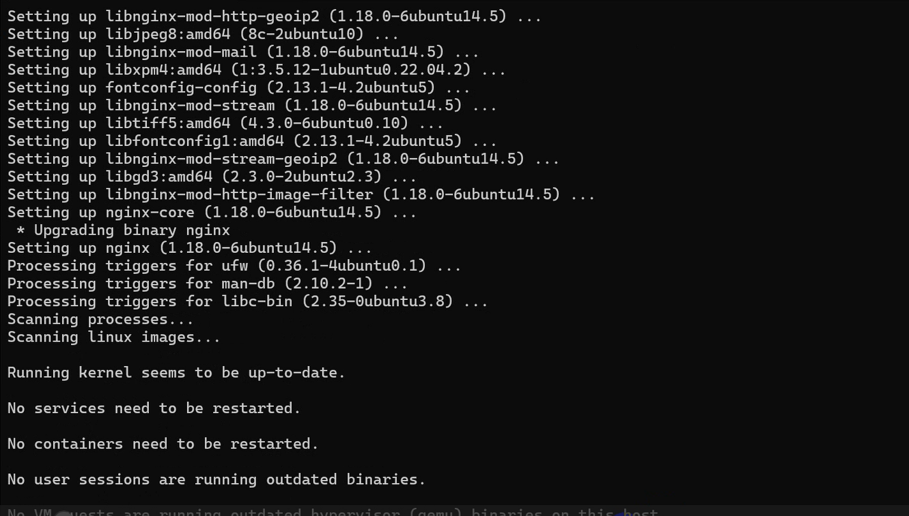

### 5. ✅ Vérification de l'installation
#### Vérifier que Nginx est installé et actif:
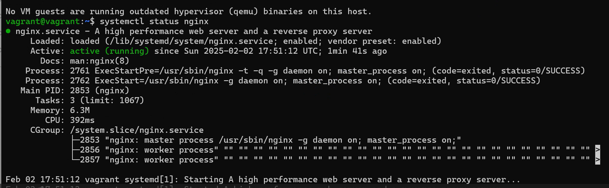
```sh
systemctl status nginx
```
Donc :Si Nginx est actif, tu verras un message indiquant "active (running)

### 6. Déploiement de l'application
```sh
cd /var/www/html
```
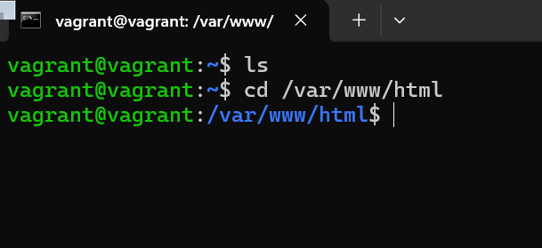
```sh
vagrant@vagrant:~$ ls /vagrant_data
index.html
vagrant@vagrant:~$
```
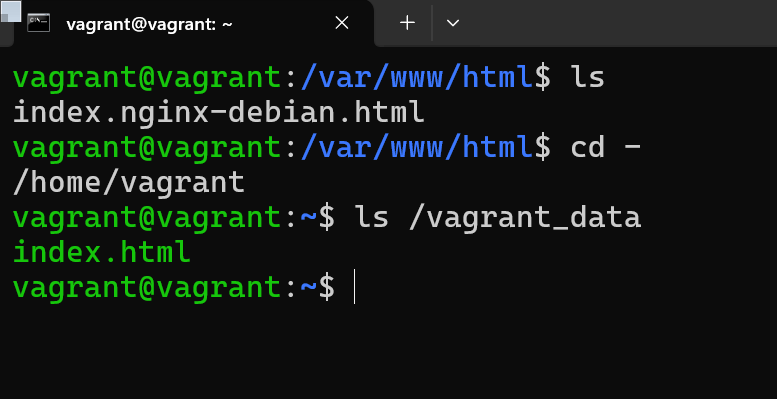

### Pour deplacer le fichier index.html vers /var/www/html/:
```sh
sudo mv /vagrant_data/index.html /var/www/html/
sudo chown www-data:www-data /var/www/html/index.html
sudo chmod 644 /var/www/html/index.html
```
### Pour qu'il s'affiche dans le navigateur: 
```sh
curl http://localhost
```
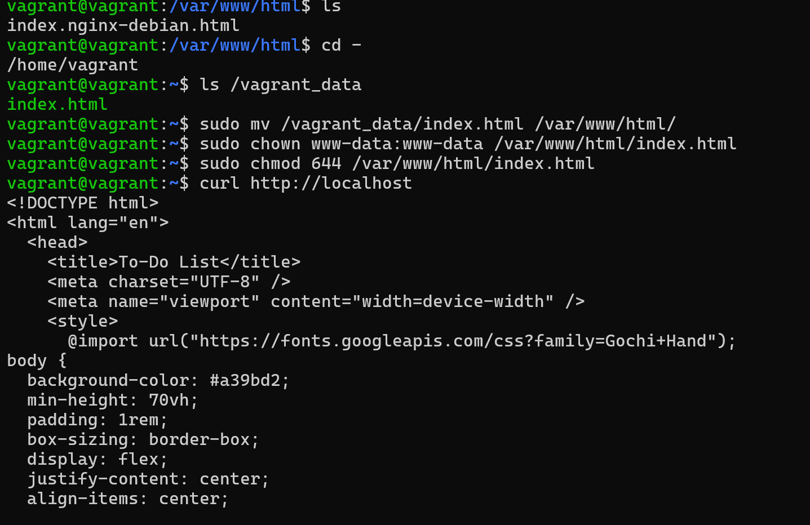

#### prenez l'adresse ip de votre app
📌 Adresse IP de l'application : 192.168.33.10


#### 👉 Ouvre ton navigateur et entre l’URL suivante : `http://192.168.33.10`
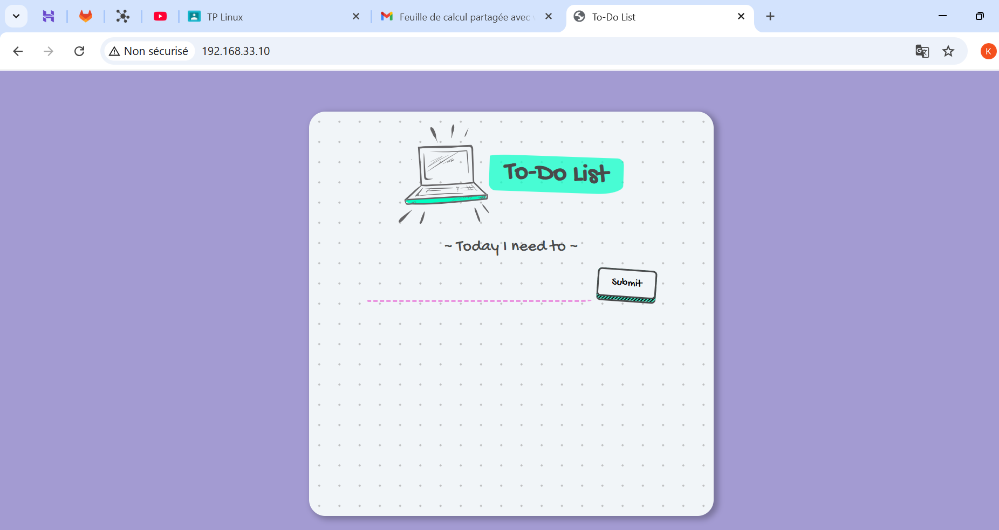
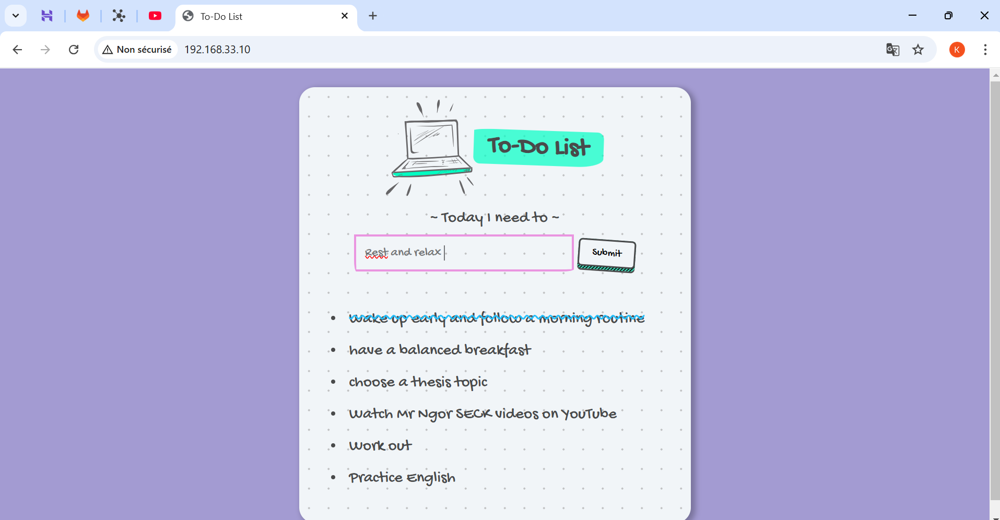

### 6. Installation de MySQL Server
```sh
sudo apt install mysql-server -y
```
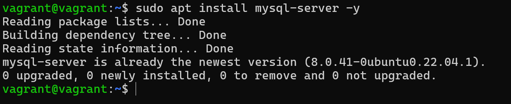
Se connecter à MySQL :
````sh
sudo mysql -u root
````
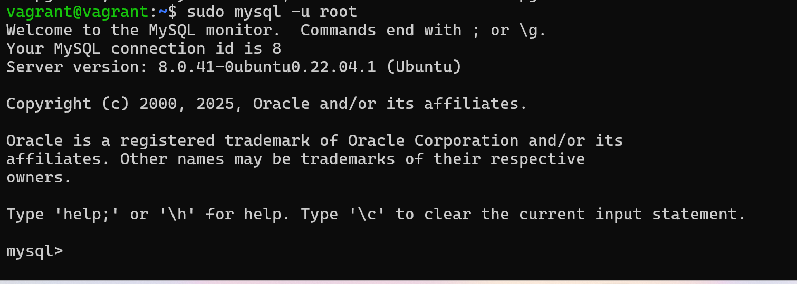

### 7. Création d'une table MySQL
```sql
CREATE TABLE utilisateurs (
    id INT AUTO_INCREMENT PRIMARY KEY,
    nom VARCHAR(50),
    email VARCHAR(100),
    age INT
);
```
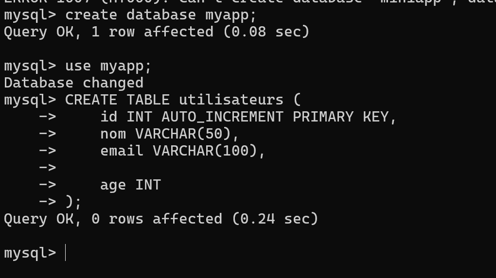

### 8. Pour arreter la machine:

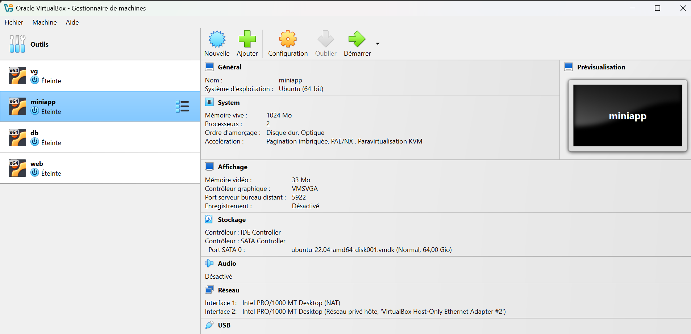


#### 🚀 Félicitations ! Tu as configuré un environnement Vagrant avec Nginx, MySQL et une mini application front-end.
#### Si tu rencontres un problème, n'hésite pas à ouvrir une issue ! 🚀
### 👤 Auteur:
#### Khadidiatou DIA
#### 📧 Email : sokhnakhadidjah@gmail.com